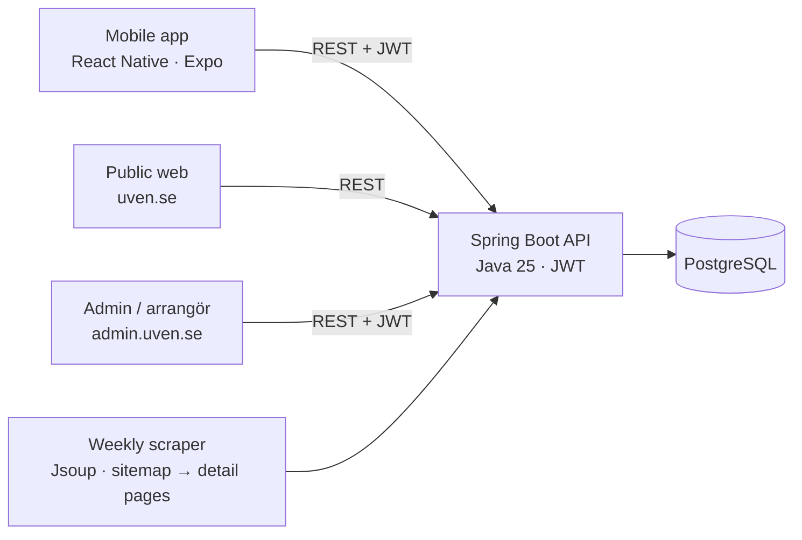

# UVEN — Umeå Events

A full-stack platform that **collects, categorises, scrapes and publishes** restaurant and
nightlife events in Umeå (pub quizzes, live music, DJ nights, stand-up…). Events come from three
sources — manual entry, recurring schedules, and automatic web scraping of venue sites — and are
reviewed by an admin before they go live.

> 🔗 **Live:** **[uven.se](https://uven.se)** (public browse) · admin/arrangör portal at
> [admin.uven.se](https://admin.uven.se) · API at [api.uven.se](https://api.uven.se)
>
> 🔑 **Try the arrangör (organiser) portal:** log in at [admin.uven.se](https://admin.uven.se)
> with **demo@uven.se** / **DemoArrangor2026**

It's three clients over one Spring Boot API:

| Repo | What |
|---|---|
| **this repo** | Backend — Java 25 / Spring Boot 4 REST API, PostgreSQL, scraping pipeline |
| `umea-event-web` | Web — public event browse **and** the admin/arrangör back-office (React + Vite) |
| `umea-event-mobile` | Mobile app — React Native + Expo |

## Architecture



## Highlights

- **Role-based auth** (USER / RESTAURANT / ADMIN) with JWT access + refresh tokens, BCrypt,
  and a config-driven first-admin bootstrap for production.
- **Full-text search** over events using PostgreSQL `tsvector` + GIN index.
- **Recurring events** via RFC 5545 `RRULE`, materialised to concrete occurrences by a scheduled
  job — DST-correct (rules stored in local wall-clock time + IANA zone, expanded to UTC).
- **Scraping pipeline** — a generic Jsoup scraper plus a sitemap→detail-page strategy for
  JS-rendered sites. Scraped events are never auto-published; they land in a review queue and an
  admin promotes them. A weekly job re-scrapes configured sources, deduplicating on a stable URL.
- **Clean architecture** — package-by-feature, controller→service→repository, DTOs over the wire
  (never entities), Flyway-owned schema (`ddl-auto=validate`), central error handling.
- **Tested & shipped** — `mvn verify` runs the full suite (incl. DB-backed integration tests) on
  GitHub Actions, deployed to Fly.io (Stockholm) with managed Postgres on Supabase and the web on
  Cloudflare.

## Tech stack

| Area | Technologies |
|---|---|
| Backend | Java 25 (LTS), Spring Boot 4, Spring Security, Spring Data JPA / Hibernate, Bean Validation, Lombok |
| Data | PostgreSQL 16, Flyway migrations, full-text search (tsvector + GIN) |
| API docs | springdoc-openapi / Swagger UI |
| Web | React, Vite, TypeScript, React Router |
| Mobile | React Native, Expo, TypeScript |
| Infra / CI | Docker, Fly.io, Supabase, Cloudflare, GitHub Actions |

## API at a glance

`/api/v1` — pluralised nouns, pagination, role-gated. A few examples:

| Method | Path | Notes |
|---|---|---|
| `GET` | `/events` | Public search over published occurrences (`?q=`, `?categoryId=`, paging) |
| `GET` | `/events/{id}` | Public event detail |
| `POST` | `/auth/register` · `/auth/login` | JWT auth (registration cannot grant ADMIN) |
| `POST` | `/events` | Create event (RESTAURANT/ADMIN) — starts as DRAFT |
| `POST` | `/admin/scrape-sources/{id}/run` | Run a scraping source (ADMIN) |
| `POST` | `/admin/scraped-events/{id}/promote` | Promote a scraped event to published (ADMIN) |

Full interactive docs: `/swagger-ui.html`.

## Run the backend locally

Requirements: JDK 25, Maven 3.9+, Docker.

```bash
docker compose up -d        # PostgreSQL on localhost:5432
mvn spring-boot:run         # Flyway migrates on startup
curl http://localhost:8080/api/v1/categories   # → the eight seeded categories
mvn verify                  # full test suite (needs the database running)
```

The Maven project lives in [`umea-events/`](umea-events/).

---

Built as a portfolio project by [Ulf Alexandersson](https://github.com/Ulfharry).
